集信达-短信平台
=========================

- [后端Gitee地址](https://gitee.com/itcastopen/itcast-sms.git)
- [后端Github地址](https://github.com/itcastopen/itcast-sms.git)
- [前端Gitee地址](https://gitee.com/itcastopen/itcast-sms-web.git)
- [前端Github地址](https://github.com/itcastopen/itcast-sms-web.git)


**在线演示**
=========================
- [官方主页](https://pip.itcast.cn/jxd)
- [演示地址](http://jxd.itheima.net)


**项目背景**
=========================

- 现在各种账户越来越多越来越重要，短信服务能够避免商家被恶意攻击，避免个人账户被盗。当账户出现异常和高风险操作时，系统自动触发验证码到用户手机上，确认是否是用户本人操作。短信本身被破解、被劫持的难度就比较高，正规的短信平台也会通过多种手段来保障短信安全,收到验证码输入几个数字即可，因此短信验证码是非常方便的一种验证方式。 对于企业商户来说，通过与正规的短信群发平台合作，低成本、低门槛、不需要太多人力财力投入，直接把短信API接入自己的网站/app里就可以了。

- 随着企业对短信规模化使用，传统短信平台的接入方式和单一的信息发送功能，已不能满足现代企业管理的需求，所以统一入口、减少对接成本、简单易行的操作与维护、高稳定、高可靠的移动信息化应用成为短信平台发展趋势。

- [了解更多项目](https://project-dev.itheima.net/java)，改变命运，少走弯路，进入真项目知识海洋畅游。


功能特性
=========================
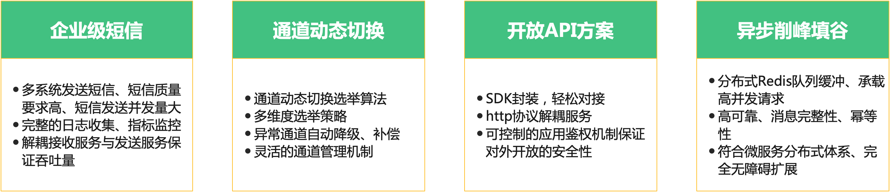


功能结构图
=========================
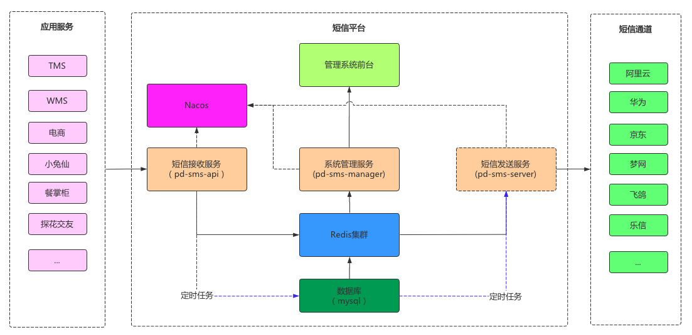
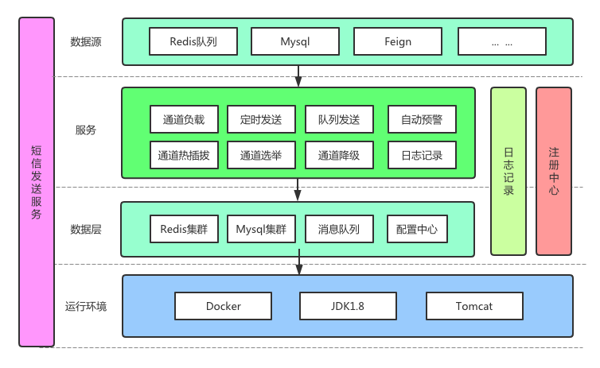
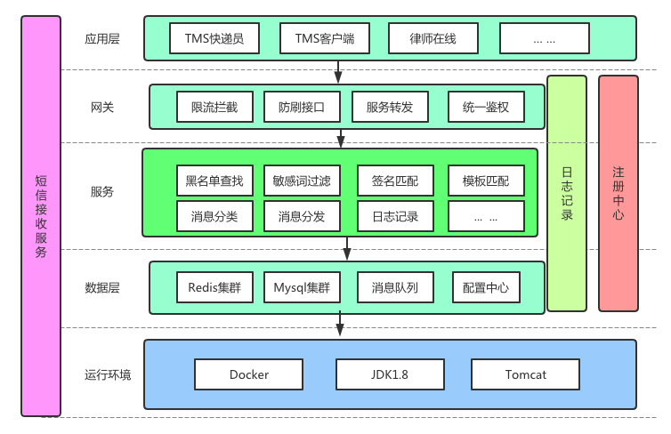


技术架构
=========================
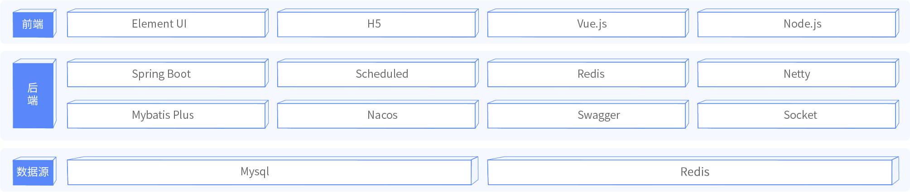

工程结构
=========================
``` 
itcast-sms
  ├
  ├── docs -- 相关image、nacos、mysql
  ├
  ├── itcast-sms-api -- 接收端
  ├
  ├── itcast-sms-entity -- 实体类
  ├
  ├── itcast-sms-manage -- 管理端
  ├
  ├── itcast-sms-sdk -- 对外开放sdk
  ├
  └── itcast-sms-server-- 服务端 
```

环境要求
=========================
- JDK ： 1.8 +
- Maven： 3.3 +
  http://maven.apache.org/download.cgi
- Mysql： 5.6.0 +
  https://downloads.mysql.com/archives/community
- Redis： 4.0 +
  https://redis.io/download
- Nacos： 1.1.4
  https://github.com/alibaba/nacos/releases


安装运行步骤
=========================
- [安装部署手册（建议下载后查看，避免格式问题）](docs/安装手册/install.md)

页面一览
=========================
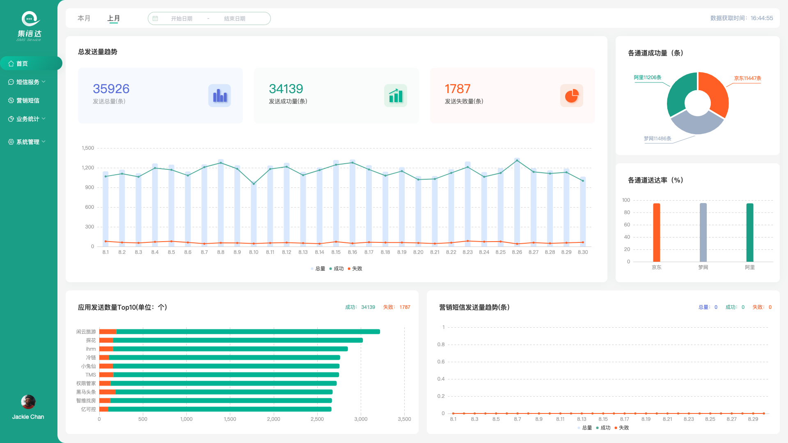
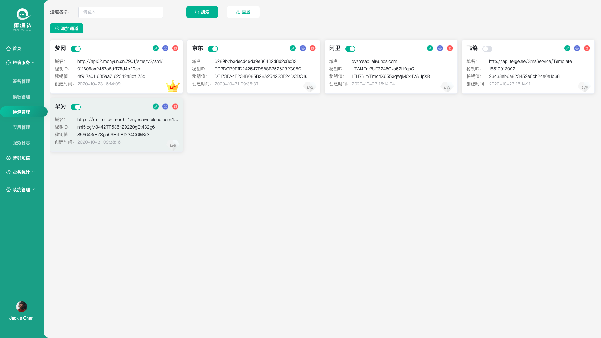
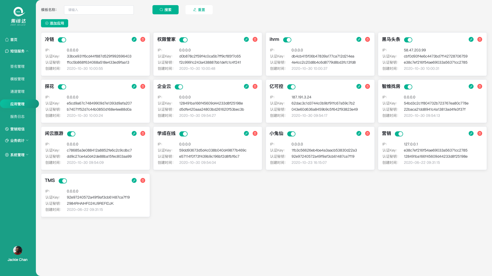
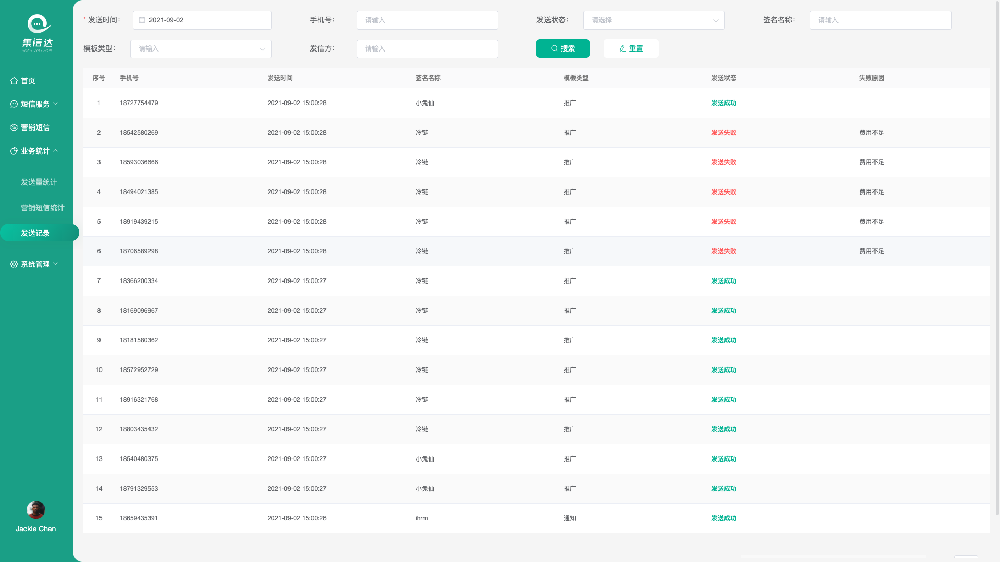
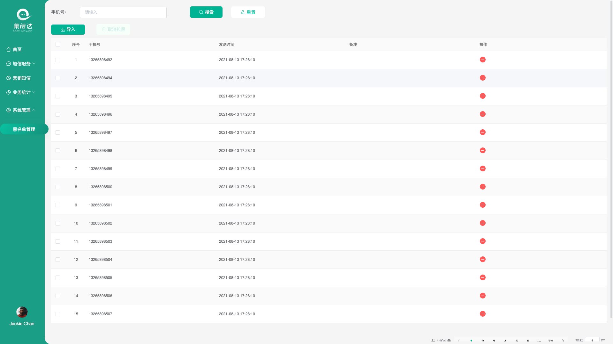

新的惊喜
=========================
想进步、要关注。关注老铁抖音号，成为'铁丝' ：）

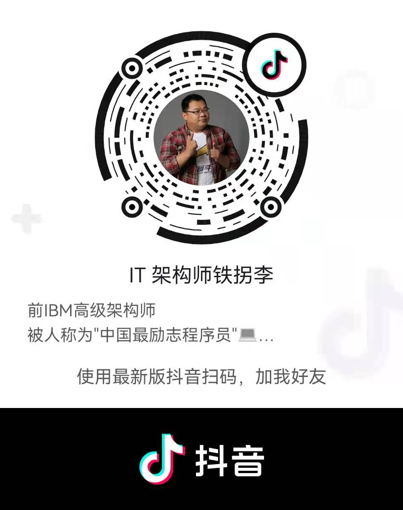
<br><br>
加微信、加入Java开源技术交流群
<br>

<br><br>

更多福利
=========================

[了解更多项目](https://pip.itcast.cn/home)
