# 1 集信达

## 1.1 环境安装：

`本次环境安装使用docker方式部署`

### 1.1.1 安装nacos

```shell
# 安装nacos
docker run --env MODE=standalone --name nacos -d -p 8848:8848 nacos/nacos-server
# 查看日志
docker logs -f nacos
```

测试 地址：http://localhost:8848/nacos    用户名：nacos   密码：nacos

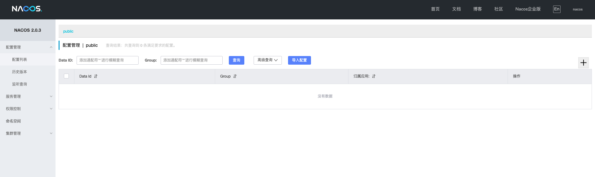

### 1.1.2 安装mysql

```shell
# 安装mysql
docker run --name mysql -e MYSQL_ROOT_PASSWORD=123456 -d -i -p 3306:3306 mysql:latest
# 查看日志
docker logs -f mysql
```

测试（使用navcat）  Host：localhost    Port：3306    User Name：root    Password：123456

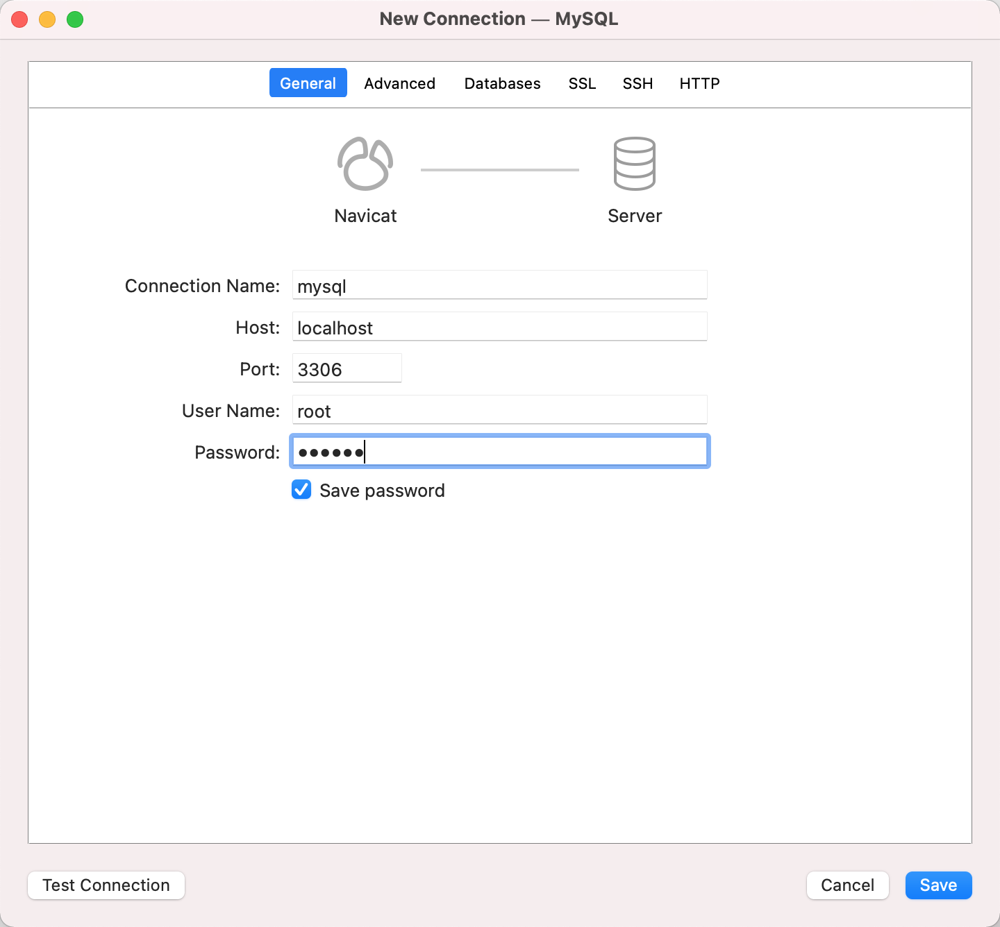

录入信息后 点击【Test Connection】按钮，弹出‘Successful’ 字样表示成功


### 1.1.3 安装redis (哨兵)

第一步：执行redis启动命令

```shell
# 切换目录到 doc/dockerfile/redis
docker-compose -f docker-compose.yml up -d
```

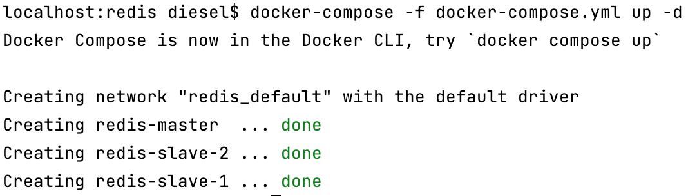

第二步：执行sentinel启动命令

```shell
# 切换目录到 doc/dockerfile/sentinel
docker-compose -f docker-compose.yml up -d
```

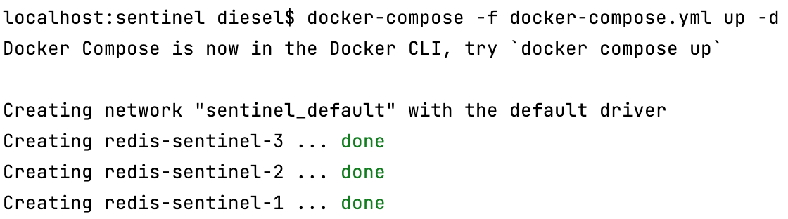


第三步：分别测试三台redis服务是否正常（使用Redis Desktop Manager）

Address：127.0.0.1 ：16380         Auth: 123456

Address：127.0.0.1 ：16381         Auth: 123456

Address：127.0.0.1 ：16382         Auth: 123456

录入信息后 点击【Test Connection】按钮，弹出‘Successful’ 字样表示成功

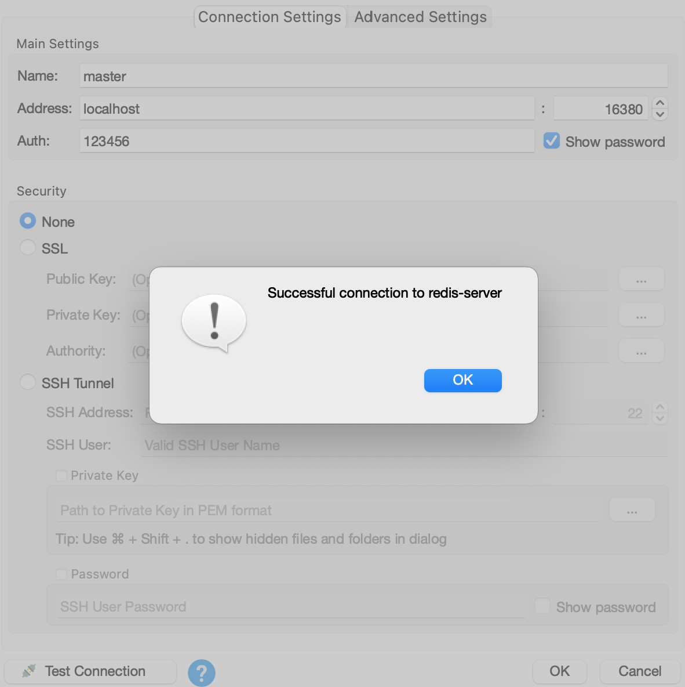

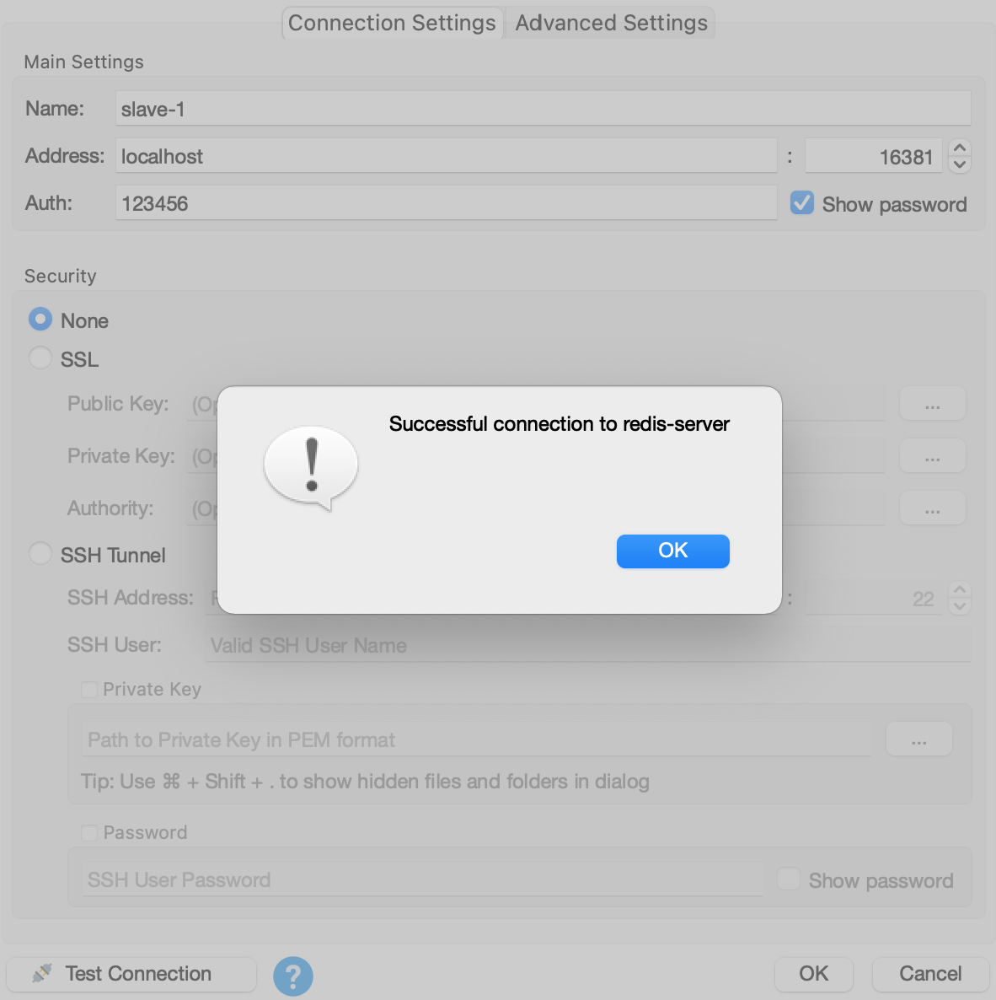

## 1.2 数据导入

### 1.2.1 nacos配置导入

#### 1.2.1.1 创建命名空间

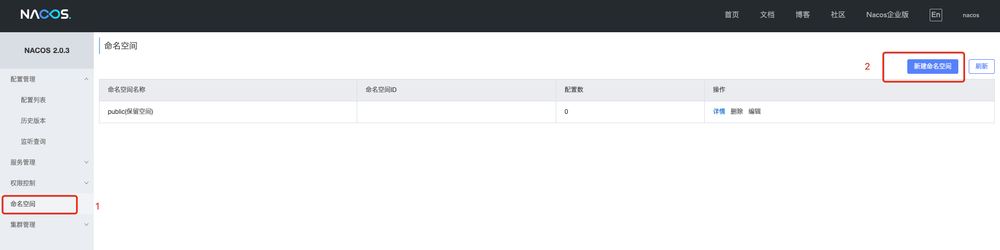

录入 信息，如下图：

- 命名空间名：itcast-sms
- 描述：集信达

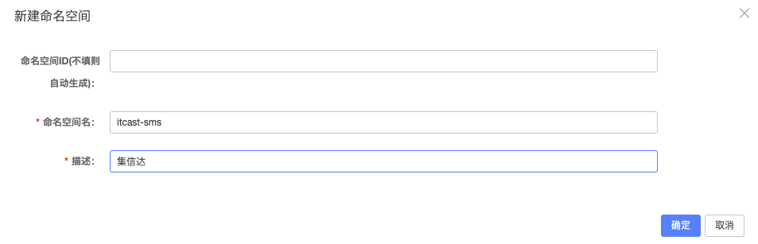

#### 1.2.1.2 导入配置

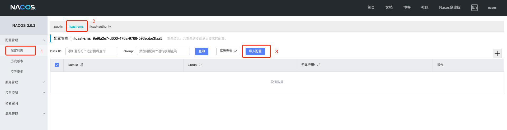

选择文件  项目根目录：docs/naocs/nacos_config_export_.zip


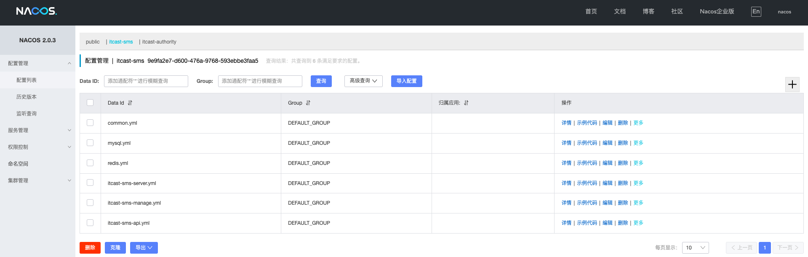


### 1.2.2 mysql数据导入

#### 1.2.2.1 创建数据库

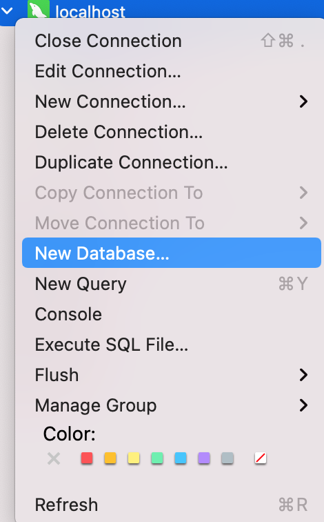

 

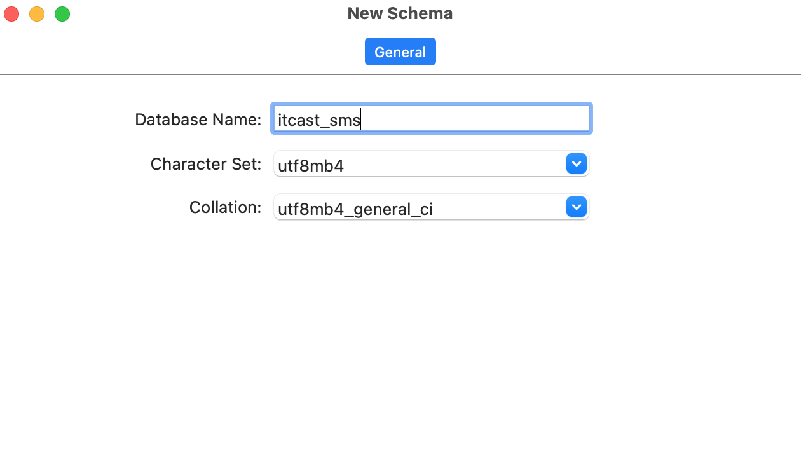

#### 1.2.2.2 导入数据库脚本

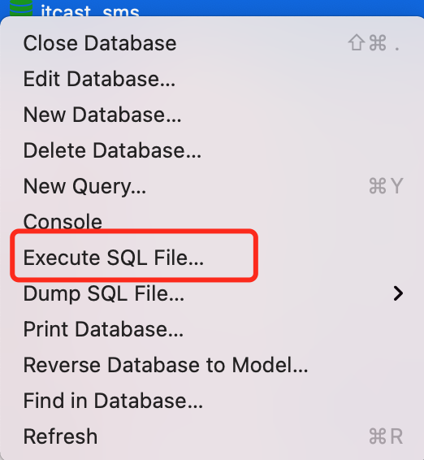

选择文件 项目根目录：docs/mysql/itcast_sms.sql

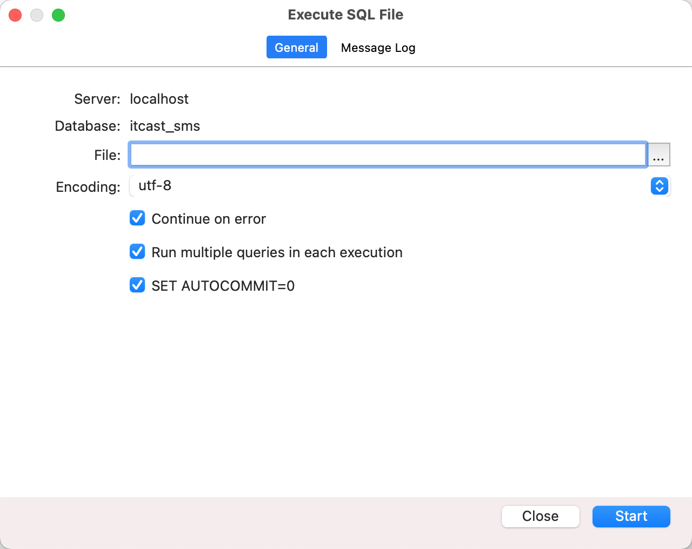

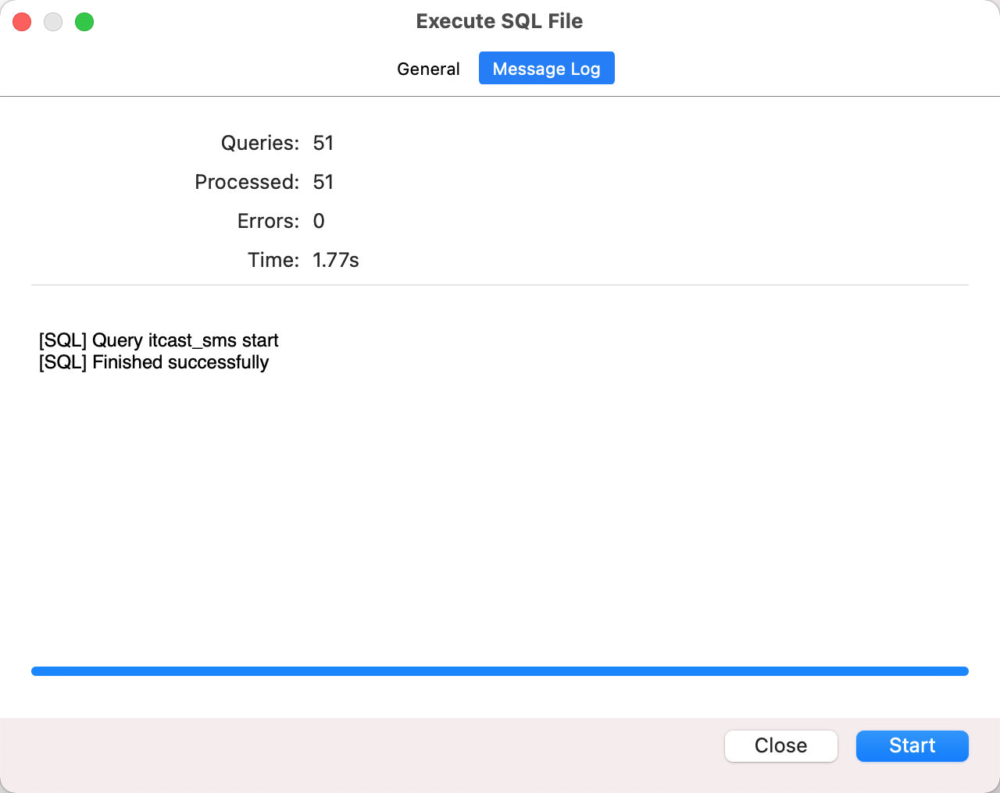

## 1.3 项目启动

### 1.3.1 修改根pom文件

修改pom中的namespace

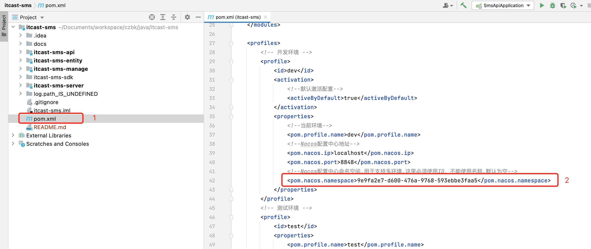

namespace 为1.2.1.1 章节中创建 

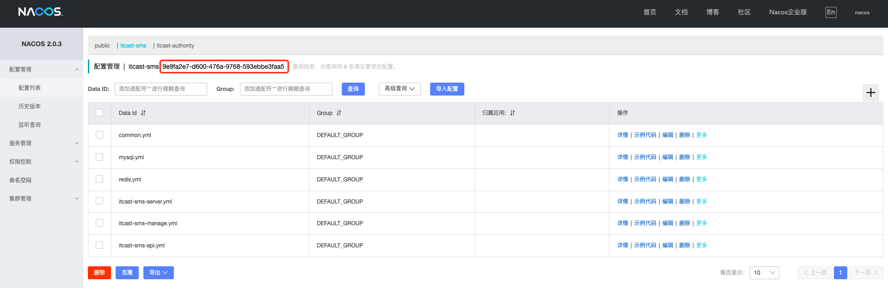

### 1.3.2 编译工程

```shell
mvn clean install -DskipTests
```

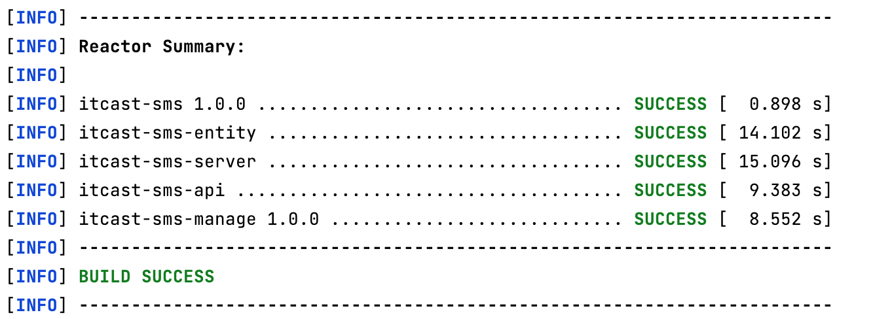

### 1.3.3 启动服务

分别启动SmsApiApplication、SmsManagerApplication、SmsServerApplication

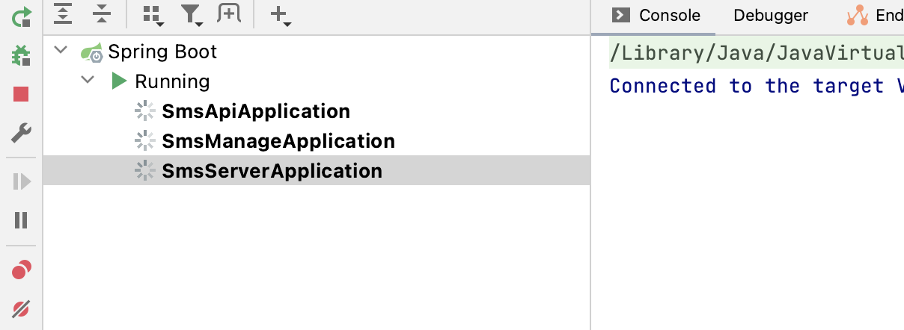


启动成功 查看SmsServerApplication日志、点击Swagger文档 选择一个接口测试服务是否正常返回

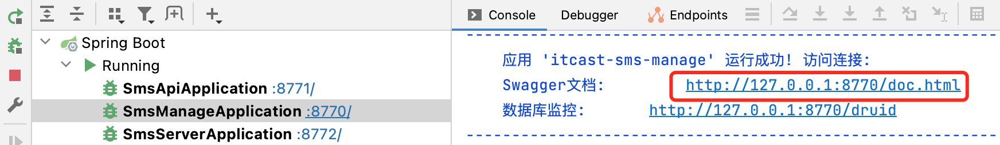

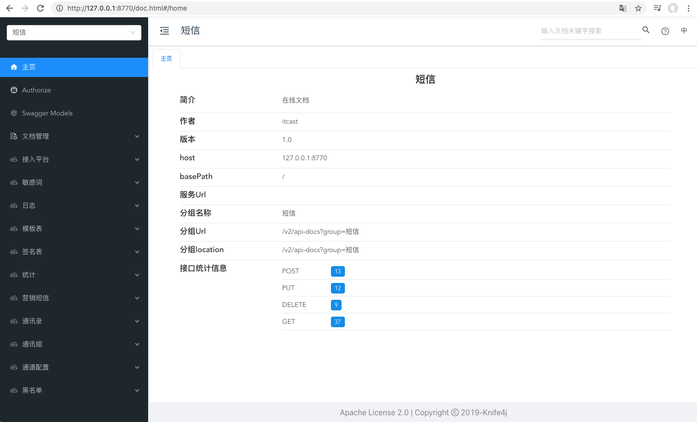

